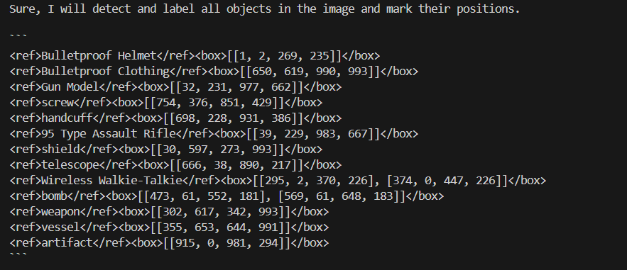

## 环境准备
Clone this repository:
```bash
git clone https://github.com/OpenGVLab/InternVL.git
```
Create a conda virtual environment and activate it:
```bash
conda create -n internvl python=3.9 -y
conda activate internvl
```
Install dependencies using requirements.txt:
```bash
pip install -r requirements.txt
By default, our requirements.txt file includes the following dependencies:

-r requirements/internvl_chat.txt

-r requirements/streamlit_demo.txt

-r requirements/classification.txt

-r requirements/segmentation.txt
```
The clip_benchmark.txt is not included in the default installation. If you require the clip_benchmark functionality, please install it manually by running the following command:
```bash
pip install -r requirements/clip_benchmark.txt
```

还需要额外安装：
Install flash-attn==2.3.6:
```bash
pip install flash-attn==2.3.6 --no-build-isolation
```
Alternatively you can compile from source:
```bash
git clone https://github.com/Dao-AILab/flash-attention.git
cd flash-attention
git checkout v2.3.6
python setup.py install
```

## 模型下载
本项目中主要下载的是`1~8B`的模型
#### 多模态大语言模型 (InternVL 2.0)

<table>
  <tr>
    <th>Model Name</th>
    <th>Vision Part</th>
    <th>Language Part</th>
    <th>HF&nbsp;Link</th>
    <th>MS&nbsp;Link</th>
    <th>Document</th>
  </tr>
  <tr>
    <td>InternVL2&#8209;1B</td>
    <td><a href="https://huggingface.co/OpenGVLab/InternViT-300M-448px">InternViT&#8209;300M&#8209;448px</a></td>
    <td><a href="https://huggingface.co/Qwen/Qwen2-0.5B-Instruct">Qwen2&#8209;0.5B&#8209;Instruct</a></td>
    <td><a href="https://huggingface.co/OpenGVLab/InternVL2-1B">🤗 link</a></td>
    <td><a href="https://modelscope.cn/models/OpenGVLab/InternVL2-1B">🤖 link</a></td>
    <td><a href="https://internvl.readthedocs.io/en/latest/internvl2.0/introduction.html">📖 doc</a></td>
  </tr>
  <tr>
    <td>InternVL2&#8209;2B</td>
    <td><a href="https://huggingface.co/OpenGVLab/InternViT-300M-448px">InternViT&#8209;300M&#8209;448px</a></td>
    <td><a href="https://huggingface.co/internlm/internlm2-chat-1_8b">internlm2&#8209;chat&#8209;1&#8209;8b</a></td>
    <td><a href="https://huggingface.co/OpenGVLab/InternVL2-2B">🤗 link</a></td>
    <td><a href="https://modelscope.cn/models/OpenGVLab/InternVL2-2B">🤖 link</a></td>
    <td><a href="https://internvl.readthedocs.io/en/latest/internvl2.0/introduction.html">📖 doc</a></td>
  </tr>
  <tr>
    <td>InternVL2&#8209;4B</td>
    <td><a href="https://huggingface.co/OpenGVLab/InternViT-300M-448px">InternViT&#8209;300M&#8209;448px</a></td>
    <td><a href="https://huggingface.co/microsoft/Phi-3-mini-128k-instruct">Phi&#8209;3&#8209;mini&#8209;128k&#8209;instruct</a></td>
    <td><a href="https://huggingface.co/OpenGVLab/InternVL2-4B">🤗 link</a></td>
    <td><a href="https://modelscope.cn/models/OpenGVLab/InternVL2-4B">🤖 link</a></td>
    <td><a href="https://internvl.readthedocs.io/en/latest/internvl2.0/introduction.html">📖 doc</a></td>
  </tr>
  <tr>
    <td>InternVL2&#8209;8B</td>
    <td><a href="https://huggingface.co/OpenGVLab/InternViT-300M-448px">InternViT&#8209;300M&#8209;448px</a></td>
    <td><a href="https://huggingface.co/internlm/internlm2_5-7b-chat">internlm2_5&#8209;7b&#8209;chat</a></td>
    <td><a href="https://huggingface.co/OpenGVLab/InternVL2-8B">🤗 link</a></td>
    <td><a href="https://modelscope.cn/models/OpenGVLab/InternVL2-8B">🤖 link</a></td>
    <td><a href="https://internvl.readthedocs.io/en/latest/internvl2.0/introduction.html">📖 doc</a></td>
  </tr>
  <tr>
    <td>InternVL2&#8209;26B</td>
    <td><a href="https://huggingface.co/OpenGVLab/InternViT-6B-448px-V1-5">InternViT&#8209;6B&#8209;448px&#8209;V1&#8209;5</a></td>
    <td><a href="https://huggingface.co/internlm/internlm2-chat-20b">internlm2&#8209;chat&#8209;20b</a></td>
    <td><a href="https://huggingface.co/OpenGVLab/InternVL2-26B">🤗 link</a></td>
    <td><a href="https://modelscope.cn/models/OpenGVLab/InternVL2-26B">🤖 link</a></td>
    <td><a href="https://internvl.readthedocs.io/en/latest/internvl2.0/introduction.html">📖 doc</a></td>
  </tr>
  <tr>
    <td>InternVL2&#8209;40B</td>
    <td><a href="https://huggingface.co/OpenGVLab/InternViT-6B-448px-V1-5">InternViT&#8209;6B&#8209;448px&#8209;V1&#8209;5</a></td>
    <td><a href="https://huggingface.co/NousResearch/Nous-Hermes-2-Yi-34B">Nous&#8209;Hermes&#8209;2&#8209;Yi&#8209;34B</a></td>
    <td><a href="https://huggingface.co/OpenGVLab/InternVL2-40B">🤗 link</a></td>
    <td><a href="https://modelscope.cn/models/OpenGVLab/InternVL2-40B">🤖 link</a></td>
    <td><a href="https://internvl.readthedocs.io/en/latest/internvl2.0/introduction.html">📖 doc</a></td>
  </tr>
  <tr>
    <td>InternVL2-Llama3-76B</td>
    <td><a href="https://huggingface.co/OpenGVLab/InternViT-6B-448px-V1-5">InternViT&#8209;6B&#8209;448px&#8209;V1&#8209;5</a></td>
    <td><a href="https://huggingface.co/NousResearch/Hermes-2-Theta-Llama-3-70B">Hermes‑2‑Theta‑<br>Llama‑3‑70B</a></td>
    <td><a href="https://huggingface.co/OpenGVLab/InternVL2-Llama3-76B">🤗 link</a></td>
    <td><a href="https://modelscope.cn/models/OpenGVLab/InternVL2-Llama3-76B">🤖 link</a></td>
    <td><a href="https://internvl.readthedocs.io/en/latest/internvl2.0/introduction.html">📖 doc</a></td>
  </tr>
</table>


## 构造训练数据集
构建SFT数据集，将全部数据集存放到任意目录，然后构建一个如下所示格式的`JSON`文件，存放到`internvl_chat/shell/data/`目录下，
```json
{
  "your-custom-dataset-1": {
    "root": "path/to/the/image/",
    "annotation": "path/to/the/jsonl/annotation",
    "data_augment": false,
    "repeat_time": 1,
    "length": "number of your data"
  },
  ...
}
```
例如：
```json
{
  "sharegpt4v_instruct_gpt4-vision_cap100k": {
    "root": "playground/data/",
    "annotation": "playground/opensource/sharegpt4v_instruct_gpt4-vision_cap100k.jsonl",
    "data_augment": false,
    "repeat_time": 1,
    "length": 102025
  }
}
```
建议是将官方的微调数据集也加上，这样能够在保证增加能力的同时，保留原本的能力。不过数据集的配比需要看个人。官方的微调数据集为：[InternVL-Chat-V1-2-SFT-Data](https://internvl.readthedocs.io/en/latest/internvl1.2/reproduce.html#training-datasets-preparation)
可以直接通过`HuggingFace`下载：
```bash
https://huggingface.co/datasets/OpenGVLab/InternVL-Chat-V1-2-SFT-Data
```

在每个数据集文件中，[单条数据的格式](https://internvl.readthedocs.io/en/latest/get_started/chat_data_format.html)如下：
#### 单张图片：
```json
{
  "id": 0,
  "image": "path/to/image.jpg",
  "width": 111,
  "height": 222,
  "conversations": [
    {"from": "human", "value": "<image>\nuser input"},
    {"from": "gpt", "text": "assistant output"},
    {"from": "human", "value": "user input"},
    {"from": "gpt", "text": "assistant output"}
  ]
}
```
其中，`conversations`中的`<image>`标签表示图片在对话中插入的位置，并且整个数据集中`<image>`的标签数量必须和图片的数量一致，也就是说，在单张图片的数据集中，`<image>`标签只能出现一次。

#### Grounding / Detection Data
对于输出边界框和目标检测的数据，图片的大小都需要正则化到`[0,1000]`之间，可以使用下面这个函数进行正则化：
```python
def normalize_coordinates(box, image_width, image_height):
    x1, y1, x2, y2 = box
    normalized_box = [
        round((x1 / image_width) * 1000),
        round((y1 / image_height) * 1000),
        round((x2 / image_width) * 1000),
        round((y2 / image_height) * 1000)
    ]
    return normalized_box
```
将模型的边界框输出定义为如下格式：`<ref>class name</ref><box>[[x1, y1, x2, y2], ...]</box>`。
下面是两个数据示例，输出有多个bbox的可以看第二个示例：
```json
[{
    "id": 2324,
    "image": "COCO_train2014_000000581857.jpg",
    "width": 427,
    "height": 640,
    "conversations": [
        {
            "from": "human",
            "value": "<image>\nPlease provide the bounding box coordinate of the region this sentence describes: <ref>the lady with the blue shirt</ref>"
        },
        {
            "from": "gpt",
            "value": "<ref>the lady with the blue shirt</ref><box>[[243, 469, 558, 746]]</box>"
        },
        {
            "from": "human",
            "value": "Please provide the bounding box coordinate of the region this sentence describes: <ref>woman in gray shirt facing camera on right</ref>"
        },
        {
            "from": "gpt",
            "value": "<ref>woman in gray shirt facing camera on right</ref><box>[[507, 409, 698, 740]]</box>"
        },
        {
            "from": "human",
            "value": "Please provide the bounding box coordinate of the region this sentence describes: <ref>a woman in glasses shops in an open air fruit market</ref>"
        },
        {
            "from": "gpt",
            "value": "<ref>a woman in glasses shops in an open air fruit market</ref><box>[[196, 422, 395, 708]]</box>"
        }
    ]
},
{
    "id": 78281,
    "image": "images/x00001541/000106464.jpg",
    "width": 800,
    "height": 800,
    "conversations": [
        {
            "from": "human",
            "value": "<image>\nPlease detect and label all objects in the following image and mark their positions."
        },
        {
            "from": "gpt",
            "value": "Sure, I will detect and label all objects in the image and mark their positions.\n\n```\n<ref>Bulletproof Helmet</ref><box>[[1, 2, 269, 235]]</box>\n<ref>Bulletproof Clothing</ref><box>[[650, 619, 990, 993]]</box>\n<ref>Gun Model</ref><box>[[32, 231, 977, 662]]</box>\n<ref>screw</ref><box>[[754, 376, 851, 429]]</box>\n<ref>handcuff</ref><box>[[698, 228, 931, 386]]</box>\n<ref>95 Type Assault Rifle</ref><box>[[39, 229, 983, 667]]</box>\n<ref>shield</ref><box>[[30, 597, 273, 993]]</box>\n<ref>telescope</ref><box>[[666, 38, 890, 217]]</box>\n<ref>Wireless Walkie-Talkie</ref><box>[[295, 2, 370, 226], [374, 0, 447, 226]]</box>\n<ref>bomb</ref><box>[[473, 61, 552, 181], [569, 61, 648, 183]]</box>\n<ref>weapon</ref><box>[[302, 617, 342, 993]]</box>\n<ref>vessel</ref><box>[[355, 653, 644, 991]]</box>\n<ref>artifact</ref><box>[[915, 0, 981, 294]]</box>\n```\n"
        }
    ]
}]
```
输出有多个边界框时的文本样式为：


构建流程图检测数据集的代码见：[data/construct_internvl_flowchart_datasets.py](data/construct_internvl_flowchart_datasets.py)


## 开始训练
启动微调的命令为：
```bash
# Using 8 GPUs, fine-tune the full LLM, cost about 30G per GPU
GPUS=8 PER_DEVICE_BATCH_SIZE=1 sh shell/internvl2.0/2nd_finetune/internvl2_2b_internlm2_1_8b_dynamic_res_2nd_finetune_full.sh
# Using 2 GPUs, fine-tune the LoRA, cost about 27G per GPU
GPUS=1 PER_DEVICE_BATCH_SIZE=1 sh shell/internvl2.0/2nd_finetune/internvl2_2b_internlm2_1_8b_dynamic_res_2nd_finetune_lora.sh
# Using 8 GPUs, fine-tune the LoRA, cost about 27G per GPU
GPUS=8 PER_DEVICE_BATCH_SIZE=1 sh shell/internvl2.0/2nd_finetune/internvl2_2b_internlm2_1_8b_dynamic_res_2nd_finetune_lora.sh
```

```bash
NPROC_PER_NODE=1 xtuner train internvl_v2_internlm2_2b_qlora_finetune.py  --work-dir /root/LLM-based-graph-tool/output_internvl/internvl_sft_flowchart --deepspeed deepspeed_zero1

```
## 合并推理
```bash
python3 convert_to_official.py internvl_v2_internlm2_2b_qlora_finetune.py /root/LLM-based-graph-tool/output_internvl/internvl_sft_flowchart/iter_21888.pth /root/LLM-based-graph-tool/output_internvl/InternVL2-2B/v1

```

## 效果评估


 [WARNING]  Please specify the CUTLASS repo directory as environment variable $CUTLASS_PATH
 [WARNING]  sparse_attn requires a torch version >= 1.5 and < 2.0 but detected 2.4
 [WARNING]  using untested triton version (3.0.0), only 1.0.0 is known to be compatible