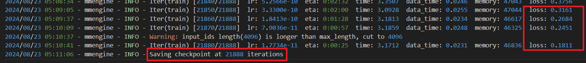

[# InternVL 部署微调实践

> 我们选定的任务是让InternVL-2B生成文生图提示词，这个任务需要VLM对图片有格式化的描述并输出。

让我们来一起完成一个用VLM模型进行冷笑话生成，让你的模型说出很逗的冷笑话吧。在这里，我们微调InterenVL使用xtuner。部署InternVL使用lmdeploy。

## 模型下载
本项目中主要下载的是`1~8B`的模型
#### 多模态大语言模型 (InternVL 2.0)

<table>
  <tr>
    <th>Model Name</th>
    <th>Vision Part</th>
    <th>Language Part</th>
    <th>HF&nbsp;Link</th>
    <th>MS&nbsp;Link</th>
    <th>Document</th>
  </tr>
  <tr>
    <td>InternVL2&#8209;1B</td>
    <td><a href="https://huggingface.co/OpenGVLab/InternViT-300M-448px">InternViT&#8209;300M&#8209;448px</a></td>
    <td><a href="https://huggingface.co/Qwen/Qwen2-0.5B-Instruct">Qwen2&#8209;0.5B&#8209;Instruct</a></td>
    <td><a href="https://huggingface.co/OpenGVLab/InternVL2-1B">🤗 link</a></td>
    <td><a href="https://modelscope.cn/models/OpenGVLab/InternVL2-1B">🤖 link</a></td>
    <td><a href="https://internvl.readthedocs.io/en/latest/internvl2.0/introduction.html">📖 doc</a></td>
  </tr>
  <tr>
    <td>InternVL2&#8209;2B</td>
    <td><a href="https://huggingface.co/OpenGVLab/InternViT-300M-448px">InternViT&#8209;300M&#8209;448px</a></td>
    <td><a href="https://huggingface.co/internlm/internlm2-chat-1_8b">internlm2&#8209;chat&#8209;1&#8209;8b</a></td>
    <td><a href="https://huggingface.co/OpenGVLab/InternVL2-2B">🤗 link</a></td>
    <td><a href="https://modelscope.cn/models/OpenGVLab/InternVL2-2B">🤖 link</a></td>
    <td><a href="https://internvl.readthedocs.io/en/latest/internvl2.0/introduction.html">📖 doc</a></td>
  </tr>
  <tr>
    <td>InternVL2&#8209;4B</td>
    <td><a href="https://huggingface.co/OpenGVLab/InternViT-300M-448px">InternViT&#8209;300M&#8209;448px</a></td>
    <td><a href="https://huggingface.co/microsoft/Phi-3-mini-128k-instruct">Phi&#8209;3&#8209;mini&#8209;128k&#8209;instruct</a></td>
    <td><a href="https://huggingface.co/OpenGVLab/InternVL2-4B">🤗 link</a></td>
    <td><a href="https://modelscope.cn/models/OpenGVLab/InternVL2-4B">🤖 link</a></td>
    <td><a href="https://internvl.readthedocs.io/en/latest/internvl2.0/introduction.html">📖 doc</a></td>
  </tr>
  <tr>
    <td>InternVL2&#8209;8B</td>
    <td><a href="https://huggingface.co/OpenGVLab/InternViT-300M-448px">InternViT&#8209;300M&#8209;448px</a></td>
    <td><a href="https://huggingface.co/internlm/internlm2_5-7b-chat">internlm2_5&#8209;7b&#8209;chat</a></td>
    <td><a href="https://huggingface.co/OpenGVLab/InternVL2-8B">🤗 link</a></td>
    <td><a href="https://modelscope.cn/models/OpenGVLab/InternVL2-8B">🤖 link</a></td>
    <td><a href="https://internvl.readthedocs.io/en/latest/internvl2.0/introduction.html">📖 doc</a></td>
  </tr>
  
</table>


## 准备环境

这里我们来手动配置下xtuner。

### 配置虚拟环境

```bash
conda create --name xtuner python=3.10 -y

# 激活虚拟环境（注意：后续的所有操作都需要在这个虚拟环境中进行）
conda activate xtuner

# 安装一些必要的库
conda install pytorch==2.1.2 torchvision==0.16.2 torchaudio==2.1.2 pytorch-cuda=12.1 -c pytorch -c nvidia -y
# 安装其他依赖
apt install libaio-dev
pip install transformers==4.39.3
pip install streamlit==1.36.0

```

### 安装xtuner

```bash
# 创建一个目录，用来存放源代码
mkdir -p /root/InternLM/code

cd /root/InternLM/code

git clone -b v0.1.23  https://github.com/InternLM/XTuner
```

进入XTuner目录

```bash
cd /root/InternLM/code/XTuner
pip install -e '.[deepspeed]'
```

- 安装LMDeploy
  
```bash
pip install lmdeploy==0.5.3
```

### 安装验证

```bash
xtuner version

##命令

xtuner help
```

### GraphViz安装
```bash
pip install networkx[default]
pip install graphviz
apt install graphviz
apt-get update
apt-get install libgraphviz-dev
pip install pygraphviz
pip install pydot
```


## 准备微调数据集
### 数据集构造方式参考本项目中的InternVL实践指南_官方教程
[InternVL实践指南_官方教程](./InternVL实践指南_官方教程.md)

### InternVL 微调攻略

#### 准备数据集
数据集格式为：

```json


# 为了高效训练，请确保数据格式为：
{
    "id": "000000033471",
    "image": ["coco/train2017/000000033471.jpg"], # 如果是纯文本，则该字段为 None 或者不存在
    "conversations": [
      {
        "from": "human",
        "value": "<image>\nWhat are the colors of the bus in the image?"
      },
      {
        "from": "gpt",
        "value": "The bus in the image is white and red."
      }
    ]
  }
```

#### 配置微调参数

> 让我们一起修改XTuner下 InternVL的config，文件在：
/root/InternLM/code/XTuner/xtuner/configs/internvl/v2/internvl_v2_internlm2_2b_qlora_finetune.py


- 需要修改的部分


最基础修改一下模型地址和数据地址即可。


**除了这两个配置外，本项目还设置了`freeze_visual_encoder=False`，`quantization_llm=False`，并且取消了Lora，目的是能够让模型更好的学习到图片信息。因为使用的是2B版本，所以全量微调也能够完成。**

- 总体config文件
```python
# Copyright (c) OpenMMLab. All rights reserved.
from mmengine.hooks import (CheckpointHook, DistSamplerSeedHook, IterTimerHook,
                            LoggerHook, ParamSchedulerHook)
from mmengine.optim import AmpOptimWrapper, CosineAnnealingLR, LinearLR
from peft import LoraConfig
from torch.optim import AdamW
from transformers import AutoTokenizer

from xtuner.dataset import InternVL_V1_5_Dataset
from xtuner.dataset.collate_fns import default_collate_fn
from xtuner.dataset.samplers import LengthGroupedSampler
from xtuner.engine.hooks import DatasetInfoHook
from xtuner.engine.runner import TrainLoop
from xtuner.model import InternVL_V1_5
from xtuner.utils import PROMPT_TEMPLATE

#######################################################################
#                          PART 1  Settings                           #
#######################################################################
# Model
path = '/root/models/InternVL2-2B'

# Data
data_root = '/root/InternLM/datasets/CLoT_cn_2000/'
data_path = data_root + 'ex_cn.json'
image_folder = data_root
prompt_template = PROMPT_TEMPLATE.internlm2_chat
max_length = 6656

# Scheduler & Optimizer
batch_size = 4  # per_device
accumulative_counts = 4
dataloader_num_workers = 4
max_epochs = 6
optim_type = AdamW
# official 1024 -> 4e-5
lr = 2e-5
betas = (0.9, 0.999)
weight_decay = 0.05
max_norm = 1  # grad clip
warmup_ratio = 0.03

# Save
save_steps = 1000
save_total_limit = 1  # Maximum checkpoints to keep (-1 means unlimited)

#######################################################################
#            PART 2  Model & Tokenizer & Image Processor              #
#######################################################################
model = dict(
    type=InternVL_V1_5,
    model_path=path,
    freeze_llm=True,
    freeze_visual_encoder=True,
    quantization_llm=True,  # or False
    quantization_vit=False,  # or True and uncomment visual_encoder_lora
    # comment the following lines if you don't want to use Lora in llm
    llm_lora=dict(
        type=LoraConfig,
        r=128,
        lora_alpha=256,
        lora_dropout=0.05,
        target_modules=None,
        task_type='CAUSAL_LM'),
    # uncomment the following lines if you don't want to use Lora in visual encoder # noqa
    # visual_encoder_lora=dict(
    #     type=LoraConfig, r=64, lora_alpha=16, lora_dropout=0.05,
    #     target_modules=['attn.qkv', 'attn.proj', 'mlp.fc1', 'mlp.fc2'])
)

#######################################################################
#                      PART 3  Dataset & Dataloader                   #
#######################################################################
llava_dataset = dict(
    type=InternVL_V1_5_Dataset,
    model_path=path,
    data_paths=data_path,
    image_folders=image_folder,
    template=prompt_template,
    max_length=max_length)

train_dataloader = dict(
    batch_size=batch_size,
    num_workers=dataloader_num_workers,
    dataset=llava_dataset,
    sampler=dict(
        type=LengthGroupedSampler,
        length_property='modality_length',
        per_device_batch_size=batch_size * accumulative_counts),
    collate_fn=dict(type=default_collate_fn))

#######################################################################
#                    PART 4  Scheduler & Optimizer                    #
#######################################################################
# optimizer
optim_wrapper = dict(
    type=AmpOptimWrapper,
    optimizer=dict(
        type=optim_type, lr=lr, betas=betas, weight_decay=weight_decay),
    clip_grad=dict(max_norm=max_norm, error_if_nonfinite=False),
    accumulative_counts=accumulative_counts,
    loss_scale='dynamic',
    dtype='float16')

# learning policy
# More information: https://github.com/open-mmlab/mmengine/blob/main/docs/en/tutorials/param_scheduler.md  # noqa: E501
param_scheduler = [
    dict(
        type=LinearLR,
        start_factor=1e-5,
        by_epoch=True,
        begin=0,
        end=warmup_ratio * max_epochs,
        convert_to_iter_based=True),
    dict(
        type=CosineAnnealingLR,
        eta_min=0.0,
        by_epoch=True,
        begin=warmup_ratio * max_epochs,
        end=max_epochs,
        convert_to_iter_based=True)
]

# train, val, test setting
train_cfg = dict(type=TrainLoop, max_epochs=max_epochs)

#######################################################################
#                           PART 5  Runtime                           #
#######################################################################
# Log the dialogue periodically during the training process, optional
tokenizer = dict(
    type=AutoTokenizer.from_pretrained,
    pretrained_model_name_or_path=path,
    trust_remote_code=True)

custom_hooks = [
    dict(type=DatasetInfoHook, tokenizer=tokenizer),
]

# configure default hooks
default_hooks = dict(
    # record the time of every iteration.
    timer=dict(type=IterTimerHook),
    # print log every 10 iterations.
    logger=dict(type=LoggerHook, log_metric_by_epoch=False, interval=10),
    # enable the parameter scheduler.
    param_scheduler=dict(type=ParamSchedulerHook),
    # save checkpoint per `save_steps`.
    checkpoint=dict(
        type=CheckpointHook,
        save_optimizer=False,
        by_epoch=False,
        interval=save_steps,
        max_keep_ckpts=save_total_limit),
    # set sampler seed in distributed evrionment.
    sampler_seed=dict(type=DistSamplerSeedHook),
)

# configure environment
env_cfg = dict(
    # whether to enable cudnn benchmark
    cudnn_benchmark=False,
    # set multi process parameters
    mp_cfg=dict(mp_start_method='fork', opencv_num_threads=0),
    # set distributed parameters
    dist_cfg=dict(backend='nccl'),
)

# set visualizer
visualizer = None

# set log level
log_level = 'INFO'

# load from which checkpoint
load_from = None

# whether to resume training from the loaded checkpoint
resume = False

# Defaults to use random seed and disable `deterministic`
randomness = dict(seed=None, deterministic=False)

# set log processor
log_processor = dict(by_epoch=False)
```

#### 开始训练

这里使用之前搞好的configs进行训练。咱们要调整一下batch size，并且使用qlora。要不半卡不够用的 QAQ。

```bash
CUDA_VISIBLE_DEVICES=1 NPROC_PER_NODE=1 xtuner train ./internvl_v2_internlm2_2b_qlora_finetune.py  --work-dir ./output_internvl/internvl_sft_flowchart2dot_v2  --deepspeed deepspeed_zero1

MKL_SERVICE_FORCE_INTEL=1 MKL_THREADING_LAYER=GNU NPROC_PER_NODE=2 xtuner train ./internvl_v2_internlm2_2b_qlora_finetune.py  --work-dir ./output_internvl/internvl_sft_flowchart2dot_v4  --deepspeed deepspeed_zero1
```


训练完成之后，在`./output_internvl/internvl_sft_flowchart`目录下会有一个pth文件，就算训练完成之后的权重。同时还有一个日志文件保存在`output_internvl/internvl_sft_flowchart/20240822_095431/20240822_095431.log`，这个日志的最后边输出模型权重保存的文件名。同时可以通过这个文件查看损失的下降情况。



#### 合并权重&&模型转换

用官方脚本进行权重合并

> 将下面的iter_3000.pth切换成训练的饿到的pth即可。

```bash
# transfer weights
python3 ./convert_to_official.py ./internvl_v2_internlm2_2b_qlora_finetune.py ./output_internvl/internvl_sft_flowchart2json_v1/iter_1100.pth ./models/InternVL2-8B-flow2json_v1/

/root/LLM-based-graph-tool/output_internvl/internvl_sft_flowchart2json_v1/iter_1100.pth
/root/LLM-based-graph-tool/output_internvl/internvl_sft_flowchart2dot2/iter_1920.pth
output_internvl/internvl_sft_flowchart2dot_v3/iter_1000.pth
```

最后我们的模型在：`./models/InternVL2-2B/`，文件格式：

```text
.
|-- added_tokens.json
|-- config.json
|-- configuration_intern_vit.py
|-- configuration_internlm2.py
|-- configuration_internvl_chat.py
|-- conversation.py
|-- generation_config.json
|-- model.safetensors
|-- modeling_intern_vit.py
|-- modeling_internlm2.py
|-- modeling_internvl_chat.py
|-- special_tokens_map.json
|-- tokenization_internlm2.py
|-- tokenizer.model
`-- tokenizer_config.json
```

### 部署微调后的模型
部署模型进行推理的代码见：[lmdeploy推理](./demo/lmdeploy_internvl2.py)


]