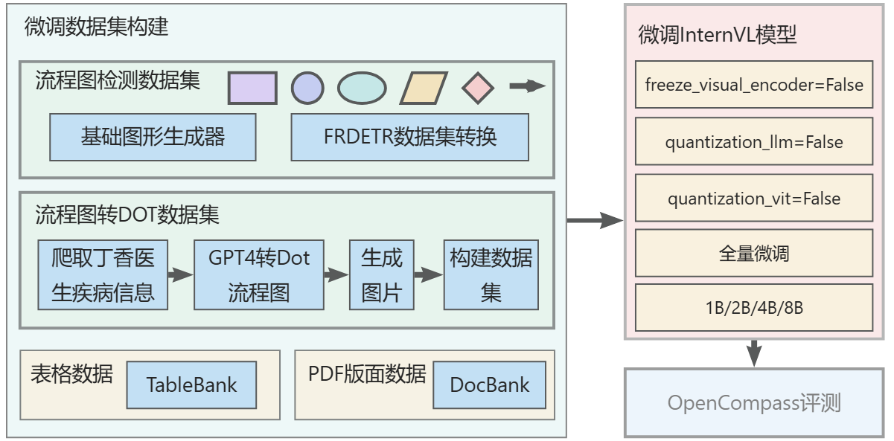

# LLM-based-graph-tool

一个基于 InternLM 的 多模态大模型图表解析器项目，欢迎大家也来参加书生大模型实战营项目

## 介绍

现在的一些多模态大模型虽然已经具备了图表解析能力，但是并不能很完美的解析出图表中的位置以及关系等信息，强如GPT4o也经常出现无法解析出坐标的问题。

所以本项目计划训练一个能够精确解析出图表的全部信息，包括坐标，OCR结果，以及复杂关系等信息。

### 训练目标
1. 使LLM能够识别流程图，并将流程图转换成`dot`,`json`,`mermaid`格式输出。
2. 使LLM能够识别表格数据，并将表格转换成`jsonn`格式输出。
3. 使LLM能够准确分析PDF的版面，按照人类阅读顺序去理解PDF内容。
4. 使LLM能够准确识别出流程图中基础图形的边界框，输出bbox坐标。

### V0版本
目前第一版模型以训练模型的`Grounding`能力为主，通过构造了`7k`输出边界框的数据集，全量微调了`InternVL2-2B`模型，目前已经能够识别出图片中的基础图形。

### Todo
1. 使LLM能够识别流程图，并将流程图转换成`dot`格式输出。(v1.0)版本
2. 使LLM能够识别流程图，并将流程图转换成`dot`,`json`,`mermaid`格式输出。(v1.1~1.2)版本
3. 使LLM能够识别表格数据，并将表格转换成`jsonn`格式输出。(v2)版本
4. 使LLM能够准确分析PDF的版面，按照人类阅读顺序去理解PDF内容。(v3)版本

## 技术方案

### 项目架构



### 1. 数据集构造
在本项目中使用的预训练数据，主要以自己构造的数据为主，因为网上已有的流程图识别数据集，表格识别数据集，PDF识别数据集较少，计划将这部分数据集作为测试集，而非训练集。还在流程图，表格等图表数据手动构造起来都很容易，可以快速生成大批量的数据。
计划构建的数据集类型有：
1. 流程图的基本图形，矩形，圆，菱形，平行四边形行等。
2. 流程图，包含节点数量从几个到几十个的流程图。
3. 表格数据，多种类型表格，会出现合并单元格
4. 医书的版面数据

开源数据集：
1. 流程图识别数据集
- **基础图形（矩形、菱形、平行四边、圆形、椭圆、箭头）识别数据集**
本项目设计了一个基础图形生成器，能够自动批量生成图形，每张图片中按照`2*2`,`3*3`,`4*4`,`5*5`,`6*6`排列。具体代码细节可见：[construct_internvl_flowchart_datasets](data/construct_internvl_flowchart_datasets.py)

- **FR-DETR数据集**
&emsp;&emsp;介绍和下载：[https://github.com/harolddu/frdetr_dataset/tree/main](https://github.com/harolddu/frdetr_dataset/tree/main)\
流程图基础图形有：


- **基于GPT4o**生成大量流程图
首先是爬取了丁香医生网站中的全部疾病信息，使用GPT4o对每个疾病的每个部分的内容单独生成一张流程图，以`dot`格式生成，然后用`graphviz`将`dot`代码保存成`png`图片，能够保存成功的，说明`gpt-4o`生成的流程图没问题。由此方法可以生成了大量的流程图，去除掉其中的图片长宽比大于`2`的部分，然后`sample`10k的数据作为数据集。同时将`dot`代码转换成`json`和`mermaid`格式，这样就得到了由流程图转换成`dot`,`json`,`mermaid`格式的数据集。

2. 表格数据集
表格数据集采用了开源的TableBank数据集，取其中的10k作为本项目的微调使用的数据集。
- **TableBank**
&emsp;&emsp;介绍和下载链接：[text](https://github.com/doc-analysis/TableBank)
- **Table Ground Truth for the UW3 and UNLV datasets** \
&emsp;&emsp;介绍：[http://iapr-tc11.org/mediawiki/index.php/Table_Ground_Truth_for_the_UW3_and_UNLV_datasets](http://iapr-tc11.org/mediawiki/index.php/Table_Ground_Truth_for_the_UW3_and_UNLV_datasets) \
&emsp;&emsp;UW3下载链接: [http://www.iapr-tc11.org/dataset/TableGT_UW3_UNLV/uw3_table_gt.tar.gz](http://www.iapr-tc11.org/dataset/TableGT_UW3_UNLV/uw3_table_gt.tar.gz) \
&emsp;&emsp;UNLV下载链接: [http://www.iapr-tc11.org/dataset/TableGT_UW3_UNLV/unlv_table_gt.tar.gz](http://www.iapr-tc11.org/dataset/TableGT_UW3_UNLV/unlv_table_gt.tar.gz) \

3. 文档版面分析
表格数据集采用了开源的DocBank数据集，取其中的10k作为本项目的微调使用的数据集。
- **DocBank**
&emsp;&emsp;介绍：[https://github.com/doc-analysis/DocBank](https://github.com/doc-analysis/DocBank)


### 2. 模型选择
本项目目前采用的是`InternVL2`多模态大模型，该模型的视觉模型采用了`InternViT`，语言模块则采用了`Qwen`,`Internlm`等模型。可以见下表：
<table>
  <tr>
    <th>Model Name</th>
    <th>Vision Part</th>
    <th>Language Part</th>
    <th>HF&nbsp;Link</th>
    <th>MS&nbsp;Link</th>
    <th>Document</th>
  </tr>
  <tr>
    <td>InternVL2&#8209;1B</td>
    <td><a href="https://huggingface.co/OpenGVLab/InternViT-300M-448px">InternViT&#8209;300M&#8209;448px</a></td>
    <td><a href="https://huggingface.co/Qwen/Qwen2-0.5B-Instruct">Qwen2&#8209;0.5B&#8209;Instruct</a></td>
    <td><a href="https://huggingface.co/OpenGVLab/InternVL2-1B">🤗 link</a></td>
    <td><a href="https://modelscope.cn/models/OpenGVLab/InternVL2-1B">🤖 link</a></td>
    <td><a href="https://internvl.readthedocs.io/en/latest/internvl2.0/introduction.html">📖 doc</a></td>
  </tr>
  <tr>
    <td>InternVL2&#8209;2B</td>
    <td><a href="https://huggingface.co/OpenGVLab/InternViT-300M-448px">InternViT&#8209;300M&#8209;448px</a></td>
    <td><a href="https://huggingface.co/internlm/internlm2-chat-1_8b">internlm2&#8209;chat&#8209;1&#8209;8b</a></td>
    <td><a href="https://huggingface.co/OpenGVLab/InternVL2-2B">🤗 link</a></td>
    <td><a href="https://modelscope.cn/models/OpenGVLab/InternVL2-2B">🤖 link</a></td>
    <td><a href="https://internvl.readthedocs.io/en/latest/internvl2.0/introduction.html">📖 doc</a></td>
  </tr>
  <tr>
    <td>InternVL2&#8209;4B</td>
    <td><a href="https://huggingface.co/OpenGVLab/InternViT-300M-448px">InternViT&#8209;300M&#8209;448px</a></td>
    <td><a href="https://huggingface.co/microsoft/Phi-3-mini-128k-instruct">Phi&#8209;3&#8209;mini&#8209;128k&#8209;instruct</a></td>
    <td><a href="https://huggingface.co/OpenGVLab/InternVL2-4B">🤗 link</a></td>
    <td><a href="https://modelscope.cn/models/OpenGVLab/InternVL2-4B">🤖 link</a></td>
    <td><a href="https://internvl.readthedocs.io/en/latest/internvl2.0/introduction.html">📖 doc</a></td>
  </tr>
  <tr>
    <td>InternVL2&#8209;8B</td>
    <td><a href="https://huggingface.co/OpenGVLab/InternViT-300M-448px">InternViT&#8209;300M&#8209;448px</a></td>
    <td><a href="https://huggingface.co/internlm/internlm2_5-7b-chat">internlm2_5&#8209;7b&#8209;chat</a></td>
    <td><a href="https://huggingface.co/OpenGVLab/InternVL2-8B">🤗 link</a></td>
    <td><a href="https://modelscope.cn/models/OpenGVLab/InternVL2-8B">🤖 link</a></td>
    <td><a href="https://internvl.readthedocs.io/en/latest/internvl2.0/introduction.html">📖 doc</a></td>
  </tr>
  <tr>
    <td>InternVL2&#8209;26B</td>
    <td><a href="https://huggingface.co/OpenGVLab/InternViT-6B-448px-V1-5">InternViT&#8209;6B&#8209;448px&#8209;V1&#8209;5</a></td>
    <td><a href="https://huggingface.co/internlm/internlm2-chat-20b">internlm2&#8209;chat&#8209;20b</a></td>
    <td><a href="https://huggingface.co/OpenGVLab/InternVL2-26B">🤗 link</a></td>
    <td><a href="https://modelscope.cn/models/OpenGVLab/InternVL2-26B">🤖 link</a></td>
    <td><a href="https://internvl.readthedocs.io/en/latest/internvl2.0/introduction.html">📖 doc</a></td>
  </tr>
  <tr>
    <td>InternVL2&#8209;40B</td>
    <td><a href="https://huggingface.co/OpenGVLab/InternViT-6B-448px-V1-5">InternViT&#8209;6B&#8209;448px&#8209;V1&#8209;5</a></td>
    <td><a href="https://huggingface.co/NousResearch/Nous-Hermes-2-Yi-34B">Nous&#8209;Hermes&#8209;2&#8209;Yi&#8209;34B</a></td>
    <td><a href="https://huggingface.co/OpenGVLab/InternVL2-40B">🤗 link</a></td>
    <td><a href="https://modelscope.cn/models/OpenGVLab/InternVL2-40B">🤖 link</a></td>
    <td><a href="https://internvl.readthedocs.io/en/latest/internvl2.0/introduction.html">📖 doc</a></td>
  </tr>
  <tr>
    <td>InternVL2-Llama3-76B</td>
    <td><a href="https://huggingface.co/OpenGVLab/InternViT-6B-448px-V1-5">InternViT&#8209;6B&#8209;448px&#8209;V1&#8209;5</a></td>
    <td><a href="https://huggingface.co/NousResearch/Hermes-2-Theta-Llama-3-70B">Hermes‑2‑Theta‑<br>Llama‑3‑70B</a></td>
    <td><a href="https://huggingface.co/OpenGVLab/InternVL2-Llama3-76B">🤗 link</a></td>
    <td><a href="https://modelscope.cn/models/OpenGVLab/InternVL2-Llama3-76B">🤖 link</a></td>
    <td><a href="https://internvl.readthedocs.io/en/latest/internvl2.0/introduction.html">📖 doc</a></td>
  </tr>
</table>

`InternVL`的模型结构如下图所示，该模型的`40B`和`76B`版本在`Image benchmark`取得了与`GPT-4o`差不多的效果，而`1~8B`模型在`Grounding Benchmarks`上均取得了还算不错的效果，可见`VIT`视觉模型的效果还算不错。
所以首先采用了该模型进行训练。


本项目计划在两个开源多模态模型的基础上进行训练，包括LLaVa和Qwen-VL，两个多模态模型都是具有grounding能力和OCR能力的模型。符合本项目要求。

### 3.微调方法
具体的训练方法可以看[InternVL实践指南_官方教程](./InternVL实践指南_官方教程.md)和[InternVL实践指南_xtuner教程](./InternVL实践指南_xtuner教程.md)两个教程，官方教程就是按照[InternVL官方网站](https://internvl.readthedocs.io/en/latest/internvl2.0/finetune.html)提供的教程进行实操得到，而Xtuner教程则是[书生大模型实战营](https://github.com/InternLM/Tutorial/tree/camp3)提供的`internvl`微调教程进行实操得到。

[InternVL实践指南_官方教程](./InternVL实践指南_官方教程.md)中详细介绍了数据集中每条数据的格式，如下所示。在第一版的
#### 构建微调数据集
**internVL2**的微调数据集格式为：
```json
[{
    "id": 2324,
    "image": "COCO_train2014_000000581857.jpg",
    "width": 427,
    "height": 640,
    "conversations": [
        {
            "from": "human",
            "value": "<image>\nPlease provide the bounding box coordinate of the region this sentence describes: <ref>the lady with the blue shirt</ref>"
        },
        {
            "from": "gpt",
            "value": "<ref>the lady with the blue shirt</ref><box>[[243, 469, 558, 746]]</box>"
        },
        {
            "from": "human",
            "value": "Please provide the bounding box coordinate of the region this sentence describes: <ref>woman in gray shirt facing camera on right</ref>"
        },
        {
            "from": "gpt",
            "value": "<ref>woman in gray shirt facing camera on right</ref><box>[[507, 409, 698, 740]]</box>"
        },
        {
            "from": "human",
            "value": "Please provide the bounding box coordinate of the region this sentence describes: <ref>a woman in glasses shops in an open air fruit market</ref>"
        },
        {
            "from": "gpt",
            "value": "<ref>a woman in glasses shops in an open air fruit market</ref><box>[[196, 422, 395, 708]]</box>"
        }
    ]
},
{
    "id": 78281,
    "image": "images/x00001541/000106464.jpg",
    "width": 800,
    "height": 800,
    "conversations": [
        {
            "from": "human",
            "value": "<image>\nPlease detect and label all objects in the following image and mark their positions."
        },
        {
            "from": "gpt",
            "value": "Sure, I will detect and label all objects in the image and mark their positions.\n\n```\n<ref>Bulletproof Helmet</ref><box>[[1, 2, 269, 235]]</box>\n<ref>Bulletproof Clothing</ref><box>[[650, 619, 990, 993]]</box>\n<ref>Gun Model</ref><box>[[32, 231, 977, 662]]</box>\n<ref>screw</ref><box>[[754, 376, 851, 429]]</box>\n<ref>handcuff</ref><box>[[698, 228, 931, 386]]</box>\n<ref>95 Type Assault Rifle</ref><box>[[39, 229, 983, 667]]</box>\n<ref>shield</ref><box>[[30, 597, 273, 993]]</box>\n<ref>telescope</ref><box>[[666, 38, 890, 217]]</box>\n<ref>Wireless Walkie-Talkie</ref><box>[[295, 2, 370, 226], [374, 0, 447, 226]]</box>\n<ref>bomb</ref><box>[[473, 61, 552, 181], [569, 61, 648, 183]]</box>\n<ref>weapon</ref><box>[[302, 617, 342, 993]]</box>\n<ref>vessel</ref><box>[[355, 653, 644, 991]]</box>\n<ref>artifact</ref><box>[[915, 0, 981, 294]]</box>\n```\n"
        }
    ]
}]
```

初步采用全量微调的方式，微调了`InternVL2-2B`模型，同时设置`freeze_visual_encoder=False`, ` quantization_llm=False`, `quantization_vit=False`，在一张A100上进行训练。

<!-- ### 4.模型评估
本项目主要评估模型识别的准确性，评估模型是否按照指令中规定的格式进行输出，一步到位的识别出图表中的全部信息，包括图表中各部分信息之间的关系，特别是流程图中的父子节点关系，表格中的行列关系，pdf数据中的阅读顺序等。 -->


## 笔记
1. [书生大模型实战营闯关记录----第八关：书生大模型全链路开源开放体系](http://t.csdnimg.cn/Ne6TS)
2. [书生大模型实战营闯关记录----第七关：模型评估，使用OpenCompass评估大模型，OpenCompass入门](http://t.csdnimg.cn/EWOOq)
3. [书生大模型实战营闯关记录----第六关：大语言模型微调实战，LoRA和QLoRA微调，理论+Xtuner微调实操](http://t.csdnimg.cn/Ak73v)
4. [书生大模型实战营闯关记录----第五关：LlamaIndex+Internlm2 RAG实践Demo：效果对比，文档加载，向量库构建，检索器，模型推理](http://t.csdnimg.cn/QTtZv)
5. [书生大模型实战营闯关记录----第四关：提示词工程实践，什么是Prompt，提示词设计框架CRISPE/CO-STAR，LangGPT结构化提示词](http://t.csdnimg.cn/SQRcI)
6. [书生大模型实战营闯关记录----第三关：8G 显存玩转书生大模型 Demo](http://t.csdnimg.cn/hvzvD)
7. [书生大模型实战营闯关记录----第二关：实现word_count统计文本中word频次](http://t.csdnimg.cn/NcA9n)
8. [书生大模型实战营闯关记录----第一关：Linux基础知识，SSH连接远程服务器，Linux常用命令，创建Anaconda虚拟环境](http://t.csdnimg.cn/YlXwv)

