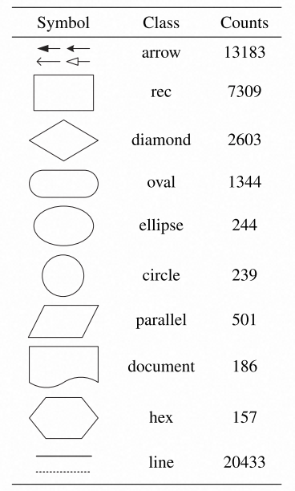
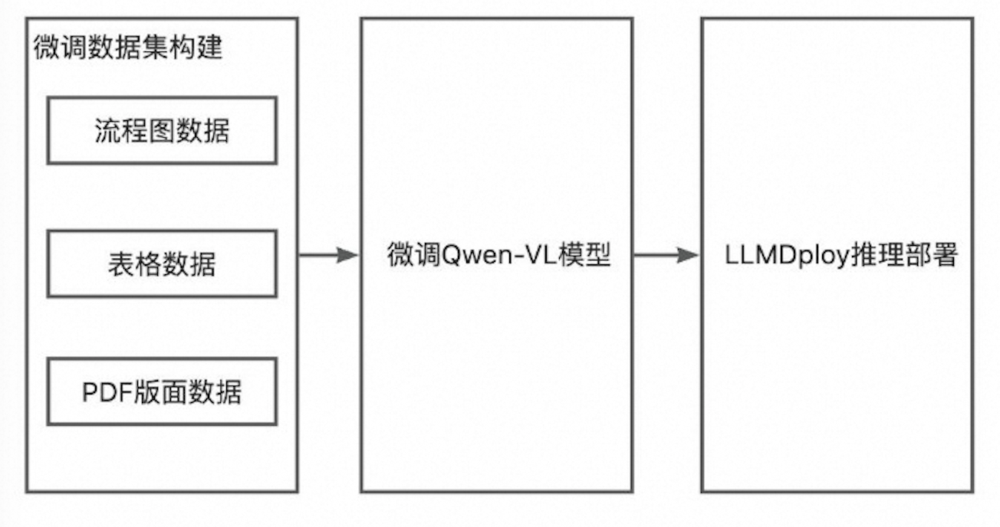

# LLM-based-graph-tool

一个基于 InternLM 的 多模态大模型图表解析器项目，欢迎大家也来参加书生大模型实战营项目

## 介绍

现在的一些多模态大模型虽然已经具备了图表解析能力，但是并不能很完美的解析出图表中的位置以及关系等信息，强如GPT4o也经常出现无法解析出坐标的问题。

所以本项目计划训练一个能够精确解析出图表的全部信息，包括坐标，OCR结果，以及复杂关系等信息。

## 技术方案
### 1. 数据集构造
在本项目中使用的预训练数据，主要以自己构造的数据为主，因为网上已有的流程图识别数据集，表格识别数据集，PDF识别数据集较少，计划将这部分数据集作为测试集，而非训练集。还在流程图，表格等图表数据手动构造起来都很容易，可以快速生成大批量的数据。
计划构建的数据集类型有：
1. 流程图的基本图形，矩形，圆，菱形，平行四边形行等。
2. 流程图，包含节点数量从几个到几十个的流程图。
3. 表格数据，多种类型表格，会出现合并单元格
4. 医书的版面数据

开源数据集：
1. 表格数据集
- **TableBank**
&emsp;&emsp;介绍和下载链接：[text](https://github.com/doc-analysis/TableBank)
- **Table Ground Truth for the UW3 and UNLV datasets** \
&emsp;&emsp;介绍：[http://iapr-tc11.org/mediawiki/index.php/Table_Ground_Truth_for_the_UW3_and_UNLV_datasets](http://iapr-tc11.org/mediawiki/index.php/Table_Ground_Truth_for_the_UW3_and_UNLV_datasets) \
&emsp;&emsp;UW3下载链接: [http://www.iapr-tc11.org/dataset/TableGT_UW3_UNLV/uw3_table_gt.tar.gz](http://www.iapr-tc11.org/dataset/TableGT_UW3_UNLV/uw3_table_gt.tar.gz) \
&emsp;&emsp;UNLV下载链接: [http://www.iapr-tc11.org/dataset/TableGT_UW3_UNLV/unlv_table_gt.tar.gz](http://www.iapr-tc11.org/dataset/TableGT_UW3_UNLV/unlv_table_gt.tar.gz) \

2. 文档版面分析
- **DocBank**
&emsp;&emsp;介绍：[https://github.com/doc-analysis/DocBank](https://github.com/doc-analysis/DocBank)

3. 流程图识别数据集
- **FR-DETR数据集**
&emsp;&emsp;介绍和下载：[https://github.com/harolddu/frdetr_dataset/tree/main](https://github.com/harolddu/frdetr_dataset/tree/main)\
流程图基础图形有：



### 2. 模型选择
本项目计划在两个开源多模态模型的基础上进行训练，包括LLaVa和Qwen-VL，两个多模态模型都是具有grounding能力和OCR能力的模型。符合本项目要求。

### 3.微调方法
#### 构建微调数据集
**internVL2**的微调数据集格式为：
```json
[{
    "id": 2324,
    "image": "COCO_train2014_000000581857.jpg",
    "width": 427,
    "height": 640,
    "conversations": [
        {
            "from": "human",
            "value": "<image>\nPlease provide the bounding box coordinate of the region this sentence describes: <ref>the lady with the blue shirt</ref>"
        },
        {
            "from": "gpt",
            "value": "<ref>the lady with the blue shirt</ref><box>[[243, 469, 558, 746]]</box>"
        },
        {
            "from": "human",
            "value": "Please provide the bounding box coordinate of the region this sentence describes: <ref>woman in gray shirt facing camera on right</ref>"
        },
        {
            "from": "gpt",
            "value": "<ref>woman in gray shirt facing camera on right</ref><box>[[507, 409, 698, 740]]</box>"
        },
        {
            "from": "human",
            "value": "Please provide the bounding box coordinate of the region this sentence describes: <ref>a woman in glasses shops in an open air fruit market</ref>"
        },
        {
            "from": "gpt",
            "value": "<ref>a woman in glasses shops in an open air fruit market</ref><box>[[196, 422, 395, 708]]</box>"
        }
    ]
},
{
    "id": 78281,
    "image": "images/x00001541/000106464.jpg",
    "width": 800,
    "height": 800,
    "conversations": [
        {
            "from": "human",
            "value": "<image>\nPlease detect and label all objects in the following image and mark their positions."
        },
        {
            "from": "gpt",
            "value": "Sure, I will detect and label all objects in the image and mark their positions.\n\n```\n<ref>Bulletproof Helmet</ref><box>[[1, 2, 269, 235]]</box>\n<ref>Bulletproof Clothing</ref><box>[[650, 619, 990, 993]]</box>\n<ref>Gun Model</ref><box>[[32, 231, 977, 662]]</box>\n<ref>screw</ref><box>[[754, 376, 851, 429]]</box>\n<ref>handcuff</ref><box>[[698, 228, 931, 386]]</box>\n<ref>95 Type Assault Rifle</ref><box>[[39, 229, 983, 667]]</box>\n<ref>shield</ref><box>[[30, 597, 273, 993]]</box>\n<ref>telescope</ref><box>[[666, 38, 890, 217]]</box>\n<ref>Wireless Walkie-Talkie</ref><box>[[295, 2, 370, 226], [374, 0, 447, 226]]</box>\n<ref>bomb</ref><box>[[473, 61, 552, 181], [569, 61, 648, 183]]</box>\n<ref>weapon</ref><box>[[302, 617, 342, 993]]</box>\n<ref>vessel</ref><box>[[355, 653, 644, 991]]</box>\n<ref>artifact</ref><box>[[915, 0, 981, 294]]</box>\n```\n"
        }
    ]
}]
```
初步采用Lora微调策略，在一张A100上进行训练。

### 4.模型评估
本项目主要评估模型识别的准确性，评估模型是否按照指令中规定的格式进行输出，一步到位的识别出图表中的全部信息，包括图表中各部分信息之间的关系，特别是流程图中的父子节点关系，表格中的行列关系，pdf数据中的阅读顺序等。

## 项目架构


## 笔记

[书生大模型实战营闯关记录----第二关：实现word_count统计文本中word频次](http://t.csdnimg.cn/NcA9n)

[书生大模型实战营闯关记录----第一关：Linux基础知识，SSH连接远程服务器，Linux常用命令，创建Anaconda虚拟环境](http://t.csdnimg.cn/YlXwv)
